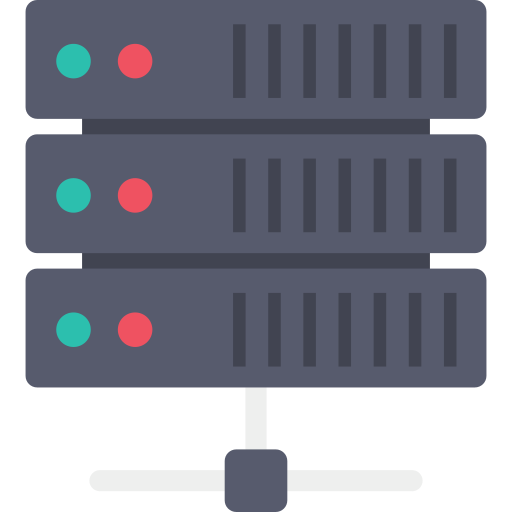
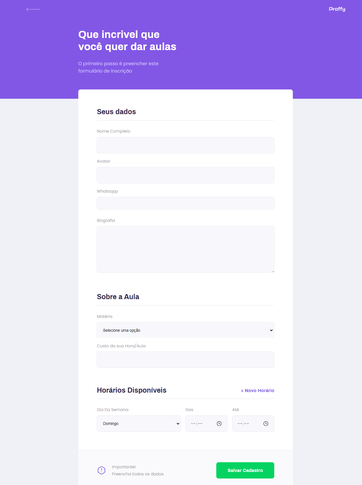

# Proffy

🇺🇸 Please refer to [docs/english](./docs/english/README.md) for an english version of this documentation.

Repositório contendo a documentação sobre o projeto Proffy, desenvolvido durante a segunda edição da #NextLevelWeek.


## O que é o Proffy?

Proffy é uma plataforma desenvolvida durante a segunda edição da Next Level Week. A idéia da plataforma é conectar professores e alunos, listando professores cadastrados e quais aulas eles oferecem. Porém a real intenção deste projeto é demonstrar o uso das tecnologias `React`, `React Native` e `Node.js` no desenvolvimento de uma aplicação full-stack.

## Sobre este projeto

Este projeto está dividido em 3 repositórios, cada um com sua aplicação específica. Sendo eles:

- Proffy Server

  
  Servidor de backend da aplicação, desenvolvido em Node.js.

  Disponível em [luizf-lf/proffy-server](https://github.com/luizf-lf/proffy-server).

- Proffy Web

  
  Aplicação Web da plataforma, desenvolvida em React.

  Disponível em [luizf-lf/proffy-web](https://github.com/luizf-lf/proffy-web).

- Proffy Mobile

  
  Aplicação Mobile da plataforma, desenvolvido em React Native, podendo ser executado em Android/iOS através do Expo.

  Disponível em [luizf-lf/proffy-mobile](https://github.com/luizf-lf/proffy-mobile).

Abaixo segue uma documentação sobre cada repositório da plataforma:

<br>

---

## Proffy Server


Disponível em [luizf-lf/proffy-server](https://github.com/luizf-lf/proffy-server).

Este repositório contém o backend da aplicação, desenvolvido em Node.js, TypeScript, e SQLite como banco de dados. O mesmo é utilizado pelas plataformas `Web` e `Mobile`.

Por utilizar o [`knex`](http://knexjs.org/) como _middleware_ entre o backend e o banco de dados, é possível configurar a utilização outras bancos de dados, como `PostgreSQL`, `MSSQL`, `MySQL`, `MariaDB`, `Oracle`, e `Amazon Redshift`, por exemplo. Inicialmente foi configurado para que seja possível utilizar uma base de dados `SQLite3`.

### Inicializando o servidor

Para inicializar o servidor de backend da aplicação, primeiro instale as dependências necessárias utilizando `yarn` ou `npm`:

`$ yarn install`
ou
`$ npm install`

Em seguida realize a migração da base de dados com o [knex](http://knexjs.org/):

`$ yarn knex:migrate`
ou
`$ npm run knex:migrate`

Este servidor utiliza o pacote [ts-node-dev](https://www.npmjs.com/package/ts-node-dev) para servir a aplicação em um ambiente de desenvolvimento. Para utilizá-lo e inicializar o servidor, utilize o seguinte comando:

`$ yarn start`
ou
`$ npm run start`

Após isso o servidor estará sendo executado, e começara a escutar requisições na porta `3333`.

### API REST

A aplicação disponibiliza alguns endpoints através de uma api REST, estes são utilizados pelos clientes Web e Mobile da plataforma Proffy.

Veja a seguir as rotas disponíveis:

`GET /classes` Listagem de aulas disponíveis.

Retorna informações dos professores e aulas de acordo com os parâmetros fornecidos através da URL.

Parâmetros disponíveis:

| Parâmetro | Tipo   | Descrição              | Exemplo    |
| --------- | ------ | ---------------------- | ---------- |
| subject   | string | Nome da matéria        | Matemática |
| week_day  | number | Dia da semana de 0 a 6 | 1          |
| time      | string | Horário em _hh:mm_     | 12:30      |

Exemplo de requisição: http://127.0.0.1:8080/classes?subject=Biologia&week_day=3&time=12:00

**Detalhe:** É **obrigatório** informar todos o parâmetros, caso contrário o servidor irá retornar um `HTTP 400 Bad Request`.

**Retorno:** JSON contendo um array de informações dos professores encontrados de acordo com o filtro da requisição.

O servidor irá sempre retornar um array de resultados, então caso não haja resultados, será retornado um array vazio.

Itens retornados após uma requisição bem sucedida:

- **id**: representa o _id_ da aula
- **subject**: representa o _assunto_ da aula
- **cost**: representa o _custo_ da hora/aula
- **user_id**: representa o _id do usuário_ responsável pela aula
- **name**: representa o _nome_ do usuário responsável pela aula
- **avatar**: representa o _link do avatar_ do responsável pela aula
- **whatsapp**: representa o _numero de Whatsapp_ do responsável pela aula
- **bio**: representa a _biografia_ do responsável pela aula

Exemplo de retorno:

```JSON
[
  {
    "id": 2,
    "subject": "Matemática",
    "cost": 90,
    "user_id": 2,
    "name": "Monica Murray",
    "avatar": "https://randomuser.me/api/portraits/women/62.jpg",
    "whatsapp": "+5511933335555",
    "bio": "Subtly charming advocate. Writer. Reader. Pop culture ninja. Music enthusiast."
  },
]
```

<br />

`POST /classes` Criação de aulas.

Nesta requisição deve ser enviado no corpo da requisição um JSON contendo as informações para cadastro de professore com nome e o horário de suas aulas.

Neste JSON deve conter os seguintes items:

- **name**: Nome do professor.
- **avatar**: URL contendo a imagem de avatar do professor.
- **whatsapp**: Numero de WhatsApp (no formato internacional) do professor.
- **bio**: Biografia do professor.
- **subject**: Nome da matéria.
- **cost**: Custo da hora/aula
- **schedule**: Array de objetos contendo informações dos horários das aulas, onde cada posição do array contém um objeto com os seguintes items:
  - **week_day**: Valor numérico de 0 a 6 que representa o dia da semana em que terá uma aula disponível. Sendo 0 como domingo e como 6 sábado.
  - **from**: Horário inicial do dia em que o professor começa o atendimento.
  - **to**: Horário final do dia em que o professor termina o atendimento.

Exemplo do corpo da requisição:

```JSON
{
  "name": "Marion Ferguson",
  "avatar": "https://randomuser.me/api/portraits/men/1.jpg",
  "whatsapp": "+5511999998888",
  "bio": "Total thinker. Reader. Travel advocate. Humble web buff. Extreme organizer. Bacon lover.",
  "subject": "Biologia",
  "cost": 40,
  "schedule": [
    {"week_day": "1", "from": "08:00", "to": "16:00"},
    {"week_day": "2", "from": "10:00", "to": "18:00"}
  ]
}
```

Caso os parâmetros estiverem corretos, o servidor irá retornar um `HTTP 201 Created`, juntamente com uma mensagem em JSON informando que a aula foi criada com sucesso:

```JSON
{
  "status": "Class created successfully"
}
```

<br />

`GET /connections` Listagem do total de conexões realizadas.

Toda vez que um aluno entra em contato com um professor, é criado o registro de uma nova conexão, e através desta rota é possível recuperar uma soma com o total de conexões já realizadas.

Não é necessário informar nenhum parâmetro na URL. Ao atingir o endpoint é retornado um JSON com o valor total de conexões já criadas:

```JSON
{
  "total": 132
}
```

<br />

`POST /connections` Criar uma nova conexão.

Nesta requisição deve ser enviado um JSON contendo apenas o _user_id_ do professor com qual foi criada a conexão.

Exemplo de requisição:

```JSON
{
  "user_id": 1
}
```

Caso a requisição for bem sucedida, o servidor irá retornar uma resposta `HTTP 201 Created`, juntamente com um JSON com uma mensagem de status:

```JSON
{
  "status": "Created"
}
```

<br />

---

## Proffy Web


Repositório da versão web da plataforma Proffy, desenvolvida durante a segunda edição da [#NextLevelWeek](https://nextlevelweek.com/).

> Esta documentação pode estar parcial ou incompleta, confira a documentação completa e atualizada de todo o projeto da plataforma Proffy em [luizf-lf/proffy](https://github.com/luizf-lf/proffy).

### Sobre

Esta versão Web da plataforma foi desenvolvida utilizando a biblioteca `React` juntamente com o uso do `TypeScript`. Nesta aplicação é demonstrado alguns conceitos como estados, roteamento, uso de componentes customizados, interfaces do TypeScript e requisições às APIs do backend com o uso da biblioteca `Axios`. Na seção sobre as [principais telas da aplicação](#principais-telas-da-aplicação), é explicado sobre as principais funcionalidades de cada tela da aplicação.

### Instruções de execução

> Leve em consideração que para utilizar todos os recursos tanto desta versão web quanto da versão mobile da aplicação, é necessário configurar e inicializar o Proffy Server. Toda a documentação está disponível em [luizf-lf/proffy-server](https://github.com/luizf-lf/proffy-server) ou [luizf-lf/proffy](https://github.com/luizf-lf/proffy).

Para inicializar esta aplicação, primeiramente é necessário baixar todas as dependências necessárias, utilizando o gerenciador de pacotes `yarn` ou `npm`, através do seguinte comando:

`$ yarn install` ou `$ npm install`

Em seguida já é possível inicializar a aplicação em modo de desenvolvimento através dos seguinte comando:

`$ yarn start` ou `$ npm run start`

Caso queira realizar o _build_ de uma versão para produção da aplicação, basta utilizar o seguinte comando:

`$ yarn build` ou `$ npm run build`

Com isto será gerado uma versão otimizada para produção na pasta `./build`.

Adicionalmente já será possível servir esta pasta utilizando o pacote [`serve`](https://www.npmjs.com/package/serve), através do seguinte comando:

`$ serve -s build`

> A instalação e especificação de demais funcionalidades deste pacote está além do escopo desta documentação.

### Principais telas da aplicação

A seguir é demonstrado algumas das principais telas da aplicação e suas principais funcionalidades, além de informações técnicas de como as informações são manipuladas pela aplicação.

Toda a aplicação foi desenvolvida de forma responsiva, utilizando _media queries_.

### Landing page


> Landing page da aplicação (Desktop).


> Landing page da aplicação (Mobile).

Na landing page da aplicação, é onde é realizado uma requisição do tipo `GET` ao endpoint `/connections` do backend para recuperar o total de conexões já realizadas. Esta requisição é disparada sempre que

Nesta tela também é possível acessar as telas de **Estudar** e **Dar Aulas**

### Estudar

Quando acessamos a tela de "Estudar", é possível fornecer informações sobre qual metéria, dia da semana e horário em que o aluno deseja filtrar.


> Página com os professores disponíveis de acordo com o filtro selecionado.

Ao topo da página é possível notar que a plataforma disponibiliza 3 campos para filtrar os professores disponíveis, juntamente com um botão "Buscar", responsável por realizar a requisição ao servidor que irá retornar os resultados.

Informações sobre os campos:

- **Matéria**: Apresenta um campo seletor com as matérias disponíveis a serem filtradas.
- **Dia Da Semana**: Apresenta um campo seletor com todos os dias da semana.
- **Hora**: Apresenta um campo com um _input_ do tipo _time_ para que o usuário digite o horário em que ele deseja ter as aulas.

> Note que o uso de um _input_ do tipo _time_ ainda é um pouco limitado em relação à abrangência dos navegadores. É possível conferir a abrangência desta feature através do site [CanIUse](https://caniuse.com/input-datetime).

Ao clicar no botão "Buscar", a aplicação dispara uma requisição do tipo do tipo `GET` ao endpoint `/connections`, contendo os parâmetros dos campos sendo passados dentro da URL do endpoint.

A documentação do [Proffy Server](https://github.com/luizf-lf/proffy-server) demonstra exatamente como devem ser passados os parâmetros durante a requisição.

Além disso, conforme descrito na documentação do Proffy Server, o servidor irá retornar um array contendo os resultados conforme o filtro enviado via requisição.

Para exibir os resultados da requisição, a aplicação utiliza a função [array.map()](https://developer.mozilla.org/pt-BR/docs/Web/JavaScript/Reference/Global_Objects/Array/map) do JavaScript, que resumidamente, percorre o array de resultados e cria um "item" na tela contendo informações do professor.

### Dar Aulas

Ao acessar a tela de "Dar Aulas", será possível preencher um formulário com informações sobre o professor e seus horários disponíveis para dar aulas.



> Formulário de cadastro de aulas (Desktop).

Informação sobre os campos do formulário:

- **Nome completo**: Deverá ser preenchido com o nome completo do Professor
- **Avatar**: URL da imagem de avatar do professor, como na plataforma não foi implementado o armazenamento de imagens no banco de dados, é necessário informar a URL da imagem em um ambiente externo.
- **Whatsapp**: Numero de whatsapp do professor, o mesmo é armazenado para que o aluno possa entrar em contato com o professor.
- **Biografia**: Campo do tipo _text field_ onde possibilita ao professor que ele escreva sobre si mesmo e sobre suas aulas.
- **Matéria**: Nome da matéria ministrada pelo professor
- **Custo da Hora/Aula**: Valor do custo de hora/aula do professor.
- **Horários disponíveis**: Nesta área é onde é possível cadastrar os dias e horários em que o professor estará disponível para atendimento.
  - **Dia da Semana**: Dia da semana em que o professor estará disponível.
  - **Das**: Horário inicial em que o professor estará disponível para atendimento, no formato _hh:mm_.
  - **Até**: Horário final em que o professor estará disponível para atendimento, no formato _hh:mm_

Após finalizar o preenchimento do formulário e clicar no botão "salvar", será disparada uma função responsável por recuperar os dados do formulário e enviar uma requisição do tipo `POST` ao endpoint `/classes` do servidor.

Pela forma como foi desenvolvida, não há nenhuma validação de campos no formulário. Caso os dados não estiverem corretos, o servidor irá retornar um `HTTP 400 Bad Request`.

<br>

---

## Proffy Mobile


> Esta documentação está sendo desenvolvida.

<br>
