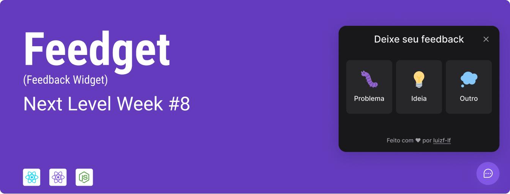

# Feedget



Um projeto web fullstack da 8ª edição do `Next Level Week`.

## Sobre

O projeto consiste em um widget de feedback, que fica posicionada no canto da tela, no qual o usuário poderá enviar comentários que serão salvos em um banco de dados através de um servidor construído em nodejs.

O projeto foi desenvolvido com `React`, `TypeScript`, `Vite`, `Tailwind CSS`, `NodeJS` e `React Native`.

Adicionalmente, foi realizado o deploy do servidor através do [Railway](https://railway.app) e do front-end através da [Vercel](https://vercel.com/).

## Executando o projeto

### Servidor

Para executar o servidor da aplicação, siga os seguintes passos:

1. A partir da raiz deste projeto, navegue até a pasta do servidor:

   ```bash
     cd server
   ```

2. Instale as dependências do projeto:

   ```bash
     npm install
   ```

3. Configure o arquivo `.env` dentro da pasta raiz do servidor, conforme arquivo de exemplo:

   ```env
     DATABASE_URL="url de acesso do banco de dados"
     MAIL_USER="usuário do servidor e-mail"
     MAIL_PASS="senha do servidor de e-mail"
     MAIL_SERVER="endereço do servidor de e-mail"
     MAIL_PORT='porta do servidor de e-mail'
   ```

4. Execute o servidor em modo de desenvolvimento:

   ```bash
     npm run dev
   ```

### Webapp

Para executar o projeto da aplicação web desenvolvida em React, siga os passos a seguir:

1. A partir da raiz do projeto, navegue até a pasta da aplicação web:

   ```bash
     cd web
   ```

2. Instale as dependências do projeto:

   ```bash
     npm install
   ```

3. Configure o arquivo `.env.local` dentro da pasta raiz do servidor, conforme arquivo de exemplo:

   ```env
     VITE_API_URL=http://endereco.do.servidor.node:porta
   ```

4. Execute a aplicação em modo de desenvolvimento:

   ```bash
     npm run dev
   ```

### Mobile app

Para executar o projeto da aplicação mobile desenvolvida em React Native, siga os passos a seguir:

1. A partir da raiz do projeto, navegue até a pasta da aplicação mobile:

   ```bash
     cd mobile
   ```

2. Instale as dependências do projeto:

   ```bash
     npm install
   ```

3. Configure o arquivo `./src/libs/api.ts` para apontar para o endereço do servidor node, conforme exemplo:

   ```typescript
   export const api = axios.create({
     baseURL: 'http://endereco.ip.servidor.node:porta',
   });
   ```

4. Execute a inicialização do `Metro`, utilitário responsável por gerir a aplicação em modo de desenvolvimento:

   ```bash
     npm run start
   ```

Após inicializar o metro, pressione `a` para abrir a aplicação no Android. O metro irá detectar automaticamente se há um emulador ativo e iniciar a aplicação.

## Próximos passos

Há algumas features que podem ser implementadas na aplicação para `atingir o próximo nível`, sendo algumas delas:

- Implementar modo claro.
- Implementar uma melhor formatação dos e-mails enviados.
- Implementar uma dashboard para prover insights sobre os feedbacks enviados.

Estas possíveis features poderão ser (e talvez serão) implementadas futuramente.

Para saber mais sobre o `#NextLevelWeek`, acesse [aqui](https://nextlevelweek.com).

> #NeverStopLearning
