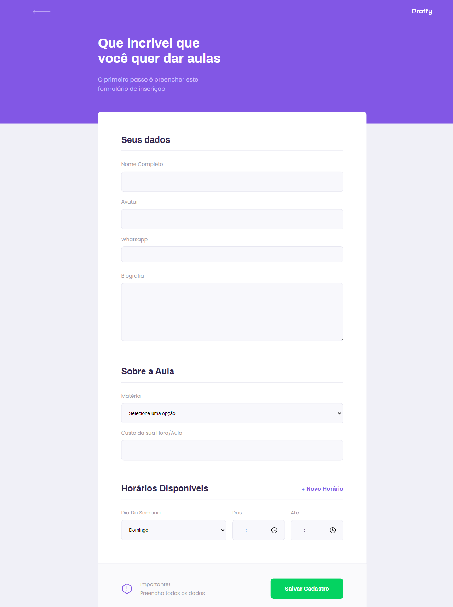

# Proffy Web

Repositório da versão web da plataforma Proffy, desenvolvida durante a segunda edição da [#NextLevelWeek](https://nextlevelweek.com/).

> Esta documentação pode estar parcial ou incompleta, confira a documentação completa e atualizada de todo o projeto da plataforma Proffy em [luizf-lf/proffy](https://github.com/luizf-lf/proffy).

## Sobre

Esta versão Web da plataforma foi desenvolvida utilizando a biblioteca `React` juntamente com o uso do `TypeScript`. Nesta aplicação é demonstrado alguns conceitos como estados, roteamento, uso de componentes customizados, interfaces do TypeScript e requisições às APIs do backend com o uso da biblioteca `Axios`. Na seção sobre as [principais telas da aplicação](#principais-telas-da-aplicação), é explicado sobre as principais funcionalidades de cada tela da aplicação.

## Instruções de execução

> Leve em consideração que para utilizar todos os recursos tanto desta versão web quanto da versão mobile da aplicação, é necessário configurar e inicializar o Proffy Server. Toda a documentação está disponível em [luizf-lf/proffy-server](https://github.com/luizf-lf/proffy-server) ou [luizf-lf/proffy](https://github.com/luizf-lf/proffy).

Para inicializar esta aplicação, primeiramente é necessário baixar todas as dependências necessárias, utilizando o gerenciador de pacotes `yarn` ou `npm`, através do seguinte comando:

`$ yarn install` ou `$ npm install`

Em seguida já é possível inicializar a aplicação em modo de desenvolvimento através dos seguinte comando:

`$ yarn start` ou `$ npm run start`

Caso queira realizar o _build_ de uma versão para produção da aplicação, basta utilizar o seguinte comando:

`$ yarn build` ou `$ npm run build`

Com isto será gerado uma versão otimizada para produção na pasta `./build`.

Adicionalmente já será possível servir esta pasta utilizando o pacote [`serve`](https://www.npmjs.com/package/serve), através do seguinte comando:

`$ serve -s build`

> A instalação e especificação de demais funcionalidades deste pacote está além do escopo desta documentação.

## Principais telas da aplicação

A seguir é demonstrado algumas das principais telas da aplicação e suas principais funcionalidades, além de informações técnicas de como as informações são manipuladas pela aplicação.

Toda a aplicação foi desenvolvida de forma responsiva, utilizando _media queries_.

### Landing page

> Landing page da aplicação (Desktop).

> Landing page da aplicação (Mobile).

Na landing page da aplicação, é onde é realizado uma requisição do tipo `GET` ao endpoint `/connections` do backend para recuperar o total de conexões já realizadas. Esta requisição é disparada sempre que

Nesta tela também é possível acessar as telas de **Estudar** e **Dar Aulas**

### Estudar

Quando acessamos a tela de "Estudar", é possível fornecer informações sobre qual metéria, dia da semana e horário em que o aluno deseja filtrar.

> Página com os professores disponíveis de acordo com o filtro selecionado.

Ao topo da página é possível notar que a plataforma disponibiliza 3 campos para filtrar os professores disponíveis, juntamente com um botão "Buscar", responsável por realizar a requisição ao servidor que irá retornar os resultados.

Informações sobre os campos:

- **Matéria**: Apresenta um campo seletor com as matérias disponíveis a serem filtradas.
- **Dia Da Semana**: Apresenta um campo seletor com todos os dias da semana.
- **Hora**: Apresenta um campo com um _input_ do tipo _time_ para que o usuário digite o horário em que ele deseja ter as aulas.

> Note que o uso de um _input_ do tipo _time_ ainda é um pouco limitado em relação à abrangência dos navegadores. É possível conferir a abrangência desta feature através do site [CanIUse](https://caniuse.com/input-datetime).

Ao clicar no botão "Buscar", a aplicação dispara uma requisição do tipo do tipo `GET` ao endpoint `/connections`, contendo os parâmetros dos campos sendo passados dentro da URL do endpoint.

A documentação do [Proffy Server](https://github.com/luizf-lf/proffy-server) demonstra exatamente como devem ser passados os parâmetros durante a requisição.

Além disso, conforme descrito na documentação do Proffy Server, o servidor irá retornar um array contendo os resultados conforme o filtro enviado via requisição.

Para exibir os resultados da requisição, a aplicação utiliza a função [array.map()](https://developer.mozilla.org/pt-BR/docs/Web/JavaScript/Reference/Global_Objects/Array/map) do JavaScript, que resumidamente, percorre o array de resultados e cria um "item" na tela contendo informações do professor.

### Dar Aulas

Ao acessar a tela de "Dar Aulas", será possível preencher um formulário com informações sobre o professor e seus horários disponíveis para dar aulas.

> Formulário de cadastro de aulas (Desktop).

Informação sobre os campos do formulário:

- **Nome completo**: Deverá ser preenchido com o nome completo do Professor
- **Avatar**: URL da imagem de avatar do professor, como na plataforma não foi implementado o armazenamento de imagens no banco de dados, é necessário informar a URL da imagem em um ambiente externo.
- **Whatsapp**: Numero de whatsapp do professor, o mesmo é armazenado para que o aluno possa entrar em contato com o professor.
- **Biografia**: Campo do tipo _text field_ onde possibilita ao professor que ele escreva sobre si mesmo e sobre suas aulas.
- **Matéria**: Nome da matéria ministrada pelo professor
- **Custo da Hora/Aula**: Valor do custo de hora/aula do professor.
- **Horários disponíveis**: Nesta área é onde é possível cadastrar os dias e horários em que o professor estará disponível para atendimento.
  - **Dia da Semana**: Dia da semana em que o professor estará disponível.
  - **Das**: Horário inicial em que o professor estará disponível para atendimento, no formato _hh:mm_.
  - **Até**: Horário final em que o professor estará disponível para atendimento, no formato _hh:mm_

Após finalizar o preenchimento do formulário e clicar no botão "salvar", será disparada uma função responsável por recuperar os dados do formulário e enviar uma requisição do tipo `POST` ao endpoint `/classes` do servidor.

Pela forma como foi desenvolvida, não há nenhuma validação de campos no formulário. Caso os dados não estiverem corretos, o servidor irá retornar um `HTTP 400 Bad Request`.

## Considerações Finais.

Esta aplicação foi desenvolvida seguindo as orientações passadas durante a segunda edição da Next Level Week, promovido pela equipe da RocketSeat.

O intuito do evento é "elevar a pessoa ao próximo nível", demonstrando de forma prática como desenvolver uma aplicação funcional e completa utilizando as principais tecnologias utilizadas no mercado de desenvolvimento de sistemas com tecnologias web.

Este repositório faz parte de um projeto que contém um servidor node.js, um **cliente web** e um client mobile. Não esqueça de conferir a documentação completa contendo as demais partes da plataforma Proffy em [luizf-lf/proffy](https://github.com/luizf-lf/proffy).

> </> por luizf-lf
