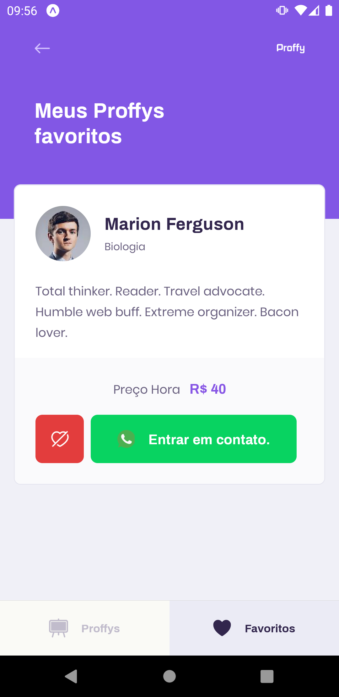

# Proffy Mobile

Repositório da versão mobile da plataforma Proffy, desenvolvida durante a segunda edição da [#NextLevelWeek](https://nextlevelweek.com/).

> Esta documentação pode estar parcial ou incompleta, confira a documentação completa e atualizada de todo o projeto da plataforma Proffy em [luizf-lf/proffy](https://github.com/luizf-lf/proffy).

## Sobre

Esta versão mobile da plataforma Proffy foi desenvolvida utilizando `TypeScript` e o `React-Native` juntamente com o `Expo`. Nesta aplicação é demonstrado o uso da plataforma [Expo](https://expo.io/) como ambiente auxiliar de desenvolvimento hibrido entre Android e iOS com o React-Native, além dos conceitos básicos do React como estados, roteamento e uso de componentes, assim como já foi visto na aplicação Web. Nesta documentação é demonstrado as [principais telas](#principais-telas-da-aplicação) da aplicação, além de suas funcionalidades principais.

## Instruções De Execução

> Leve em consideração que para utilizar todos os recursos tanto desta versão mobile quanto da versão web da aplicação, é necessário configurar e inicializar o Proffy Server. Toda a documentação está disponível em [luizf-lf/proffy-server](https://github.com/luizf-lf/proffy-server) ou [luizf-lf/proffy](https://github.com/luizf-lf/proffy).

Para inicializar o ambiente de desenvolvimento, primeiramente é necessário baixar as dependências utilizando o gerenciador de pacotes `yarn` ou `npm`:

`$ yarn install` ou `$ npm install`

Em seguida, é necessário inicializar o ambiente Expo:

`$ expo start`

Em seguida, é possível executar a aplicação em um dispositivo Android / iOS físico utilizando o app [Expo Client](https://expo.io/tools#client), disponível na [Play Store](https://play.google.com/store/apps/details?id=host.exp.exponent) ou [App Store](https://itunes.apple.com/app/apple-store/id982107779). Também é possível executar a aplicação em um AVD (Android Virtual Device), utilizando o Android Studio.

> Instruções de instalação e configuração de um AVD está além do escopo desta documentação. Confira a documentação oficial sobre a configuração de AVDs através do [site oficial](https://developer.android.com/studio/run/managing-avds).

## Principais Telas Da Aplicação

A seguir será demonstrado as principais telas da aplicação e suas principais funcionalidades, além da forma como as informações são manipuladas pela aplicação.

### Landing Page

Assim como na versão web da plataforma, ao abrir a versão mobile, o usuário será direcionado à landing page:

> Landing Page da aplicação.

Nesta tela, assim como na versão web, o usuário terá a opção de acessar outras duas das principais telas da aplicação: A tela de **Estudar** e **Dar Aulas**.

Além disso, a landing page mostra ao final da tela o total de conexões já realizadas, disparando uma requisição do tipo `GET` ao endpoint `/connections` do Proffy Server, no momento em que a tela é carregada.

### Dar Aulas

A tela de "Dar Aulas" é responsável apenas por informar que para realizar o cadastro é necessário acessar a plataforma Web da aplicação, pois o desenvolvimento do formulário não foi realizado no escopo inicial da aplicação.

> Tela "Dar Aulas" da aplicação.

Futuramente é possível realizar a implementação de uma formulário de cadastro, que por fim irá disparar uma requisição do tipo `POST` ao endpoint `/classes` contendo as informações do formulário, assim como foi feito com a aplicação Web.

### Estudar

Na tela "Estudar", logo abaixo, há uma navegação separada por abas, onde inicialmente é exibido a aba "Proffys", onde é possível filtrar os Proffys disponíveis na plataforma. Há também a aba "Favoritos" onde é exibido os Proffys favoritos pelo usuário.

Na aba "Proffys" é possível filtrar os professores. No canto superior direito, há um botão de "filtro", representado por um ícone de funil, que ao ser pressionado irá exibir o formulário com as informações a serem filtradas.

> Tela "Estudar", com a aba "Proffys" selecionada.

Ao preencher as informações e pressionar o botão "Filtrar", serão exibidos os resultados logo abaixo, ocultando automaticamente o formulário utilizado para filtrar.

É possível notar que nos resultados exibidos há um botão, representado por um ícone de coração, que ao ser pressionado irá marcar o professor como favorito, e o mesmo será salvo localmente. Além disso há um botão "Entrar em contato" que ao ser pressionado irá abrir o Whatsapp no próprio celular, caso a aplicação estiver instalada.

> Resultados da pesquisa.

Ao acessar a aba "Favoritos", é exibido a lista de professores favoritados anteriormente.

> Tela "Estudar", com a aba "Favoritos".

Nesta tela é utilizado o `AsyncStorage`, uma biblioteca Expo capaz de armazenar informações na memória interna da aplicação, com valores baseados em índices. Na [documentação](https://docs.expo.io/versions/latest/sdk/async-storage/) é possível conferir mais informações.

## Considerações Finais

Esta aplicação foi desenvolvida seguindo as orientações passadas durante a segunda edição da Next Level Week, promovido pela equipe da RocketSeat.

O intuito do evento é "elevar a pessoa ao próximo nível", demonstrando de forma prática como desenvolver uma aplicação funcional e completa utilizando as principais tecnologias utilizadas no mercado de desenvolvimento de sistemas com tecnologias web.

Este repositório faz parte de um projeto que contém um servidor node.js, um cliente web e um **cliente mobile**. Não esqueça de conferir a documentação completa contendo as demais partes da plataforma Proffy em [luizf-lf/proffy](https://github.com/luizf-lf/proffy).

> </> por luizf-lf
