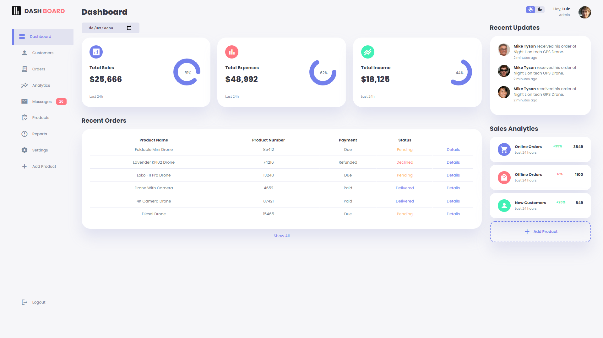
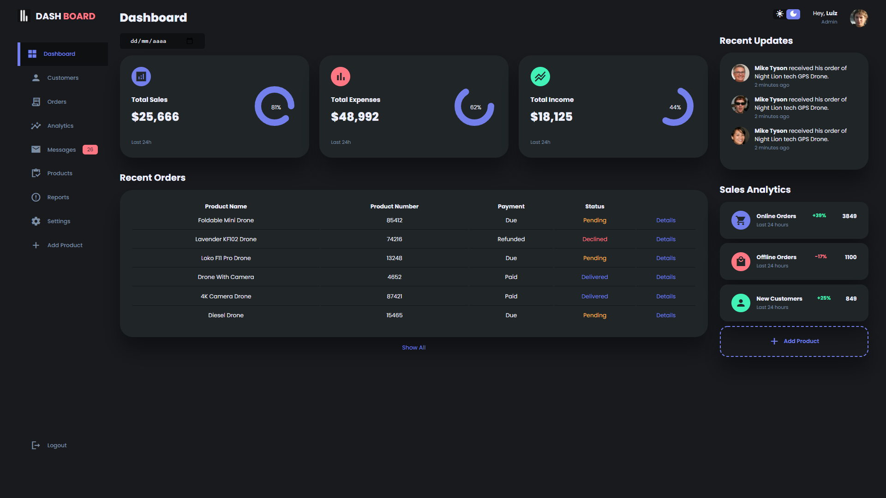
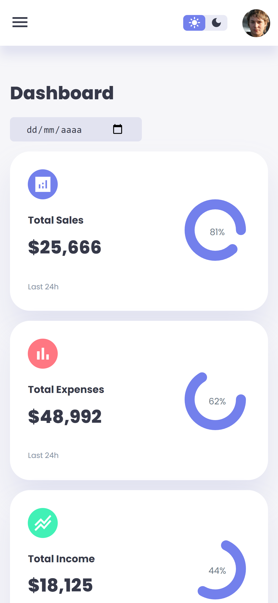
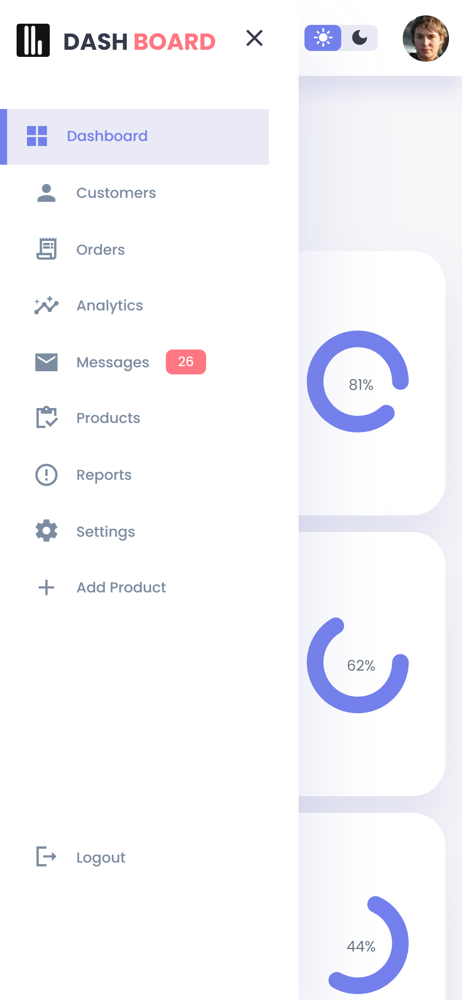

# Admin Sales Dashboard

## About

A responsive web page made with HTML, CSS & JavaScript that represents a admin dashboard layout. It was used as a layout reference for future projects.

Based on a tutorial by Egator on YouTube. [This one](https://www.youtube.com/watch?v=BOF79TAIkYQ).

## See it live

You can clone this repository and run this project by simply opening the `index.html` file from any browser.

## Screenshots

This web page contais a switch that changes the theme to Dark Mode, and it also has a mobile first layout.

### Default theme mode

### Dark theme mode

### Mobile view

