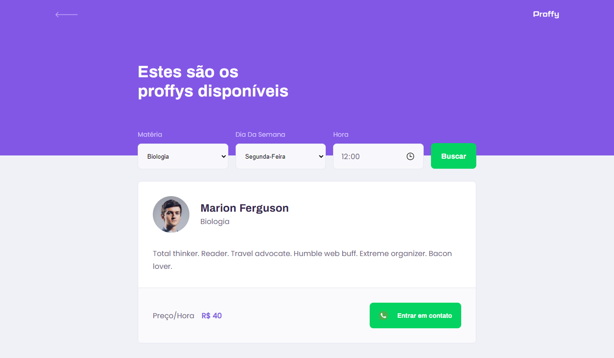
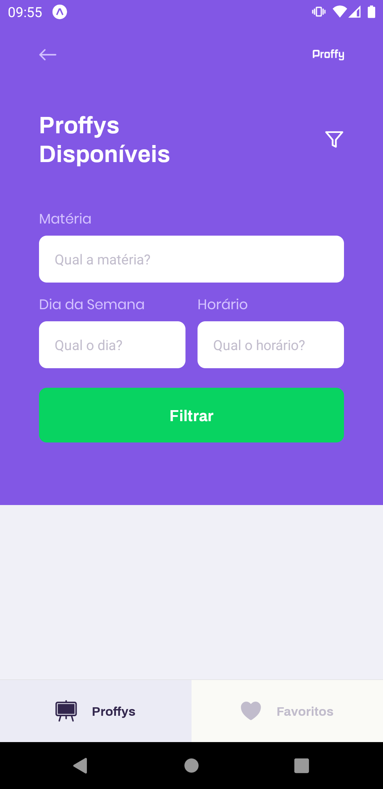

# Proffy

Repository containing documentation about the Proffy project, developed during the second edition of #NextLevelWeek.


## What is Proffy?

Proffy is a platform developed during the second edition of Next Level Week. The idea of ​​the platform is to connect teachers and students, listing registered teachers and what classes they offer. However, the real intention of this project is to demonstrate the use of `React`,` React Native` and `Node.js` in the development of a full-stack application.

## About this project

This project is divided into 3 repositories, each with its specific application. Being them:

- [Proffy Server](#proffy-server)

  
  Backend server, developed in Node.js.

  Available at [luizf-lf/proffy-server](https://github.com/luizf-lf/proffy-server).

- [Proffy-web](#proffy-web)

  
  Web application, developed in React.

  Available at [luizf-lf/proffy-web](https://github.com/luizf-lf/proffy-web).

- [Proffy Mobile](#proffy-mobile)

  
  Mobile application of the platform, developed in React Native, and can be run on Android / iOS through Expo.

  Available at [luizf-lf/proffy-mobile](https://github.com/luizf-lf/proffy-mobile).

Below is a documentation on each platform repository:

<br>

---

## Proffy Server


Available at [luizf-lf/proffy-server](https://github.com/luizf-lf/proffy-server).

This repository contains the application backend, developed in Node.js, TypeScript, and SQLite as a database. The same is used by the `Web` and` Mobile` platforms.

By using [`knex`](http://knexjs.org/) as a _middleware_ between the backend and the database, it is possible to configure the use of other databases, such as` PostgreSQL`, `MSSQL`, `MySQL`, ` MariaDB`, `Oracle`, and` Amazon Redshift`, for example. Initially it was configured to use a `SQLite3` database.

### Initializing the server

To start the application's backend server, first install the necessary dependencies using `yarn` or` npm`:

`$ yarn install`
or
`$ npm install`

Then perform the database migration with [knex](http://knexjs.org/):

`$ yarn knex:migrate`
or
`$ npm run knex:migrate`

This server uses the [ts-node-dev](https://www.npmjs.com/package/ts-node-dev) package to serve the application in a development environment. To use it and start the server, use the following command:

`$ yarn start`
or
`$ npm run start`

After that, the server will be running, and will start listening for requests on port `3333`.

### REST API

The application provides some endpoints through a REST api, these are used by Proffy Web and Mobile clients.

Here are the available routes:

`GET/classes` List of available classes.

Returns information from teachers and classes according to the parameters provided through the URL.

Available parameters:

| Parameter | Type   | Description         | Example     |
| --------- | ------ | ------------------- | ----------- |
| subject   | string | Subject name        | Mathematics |
| week_day  | number | Weekday from 0 to 6 | 1           |
| time      | string | Time in _hh:mm_     | 12:30       |

Request example: http://127.0.0.1:8080/classes?subject=Biology&week_day=3&time=12:00

**Detail:** It is **mandatory** to inform all parameters, otherwise the server will return an `HTTP 400 Bad Request`.

**Return:** JSON containing an array of information from the teachers found according to the request filter.

The server will always return an array of results, so if there are no results, an empty array will be returned.

Items returned after a successful request:

- **id**: represents the _id_ of the class
- **subject**: represents the class subject
- **cost**: represents the _cost_ of the hour / class
- **user_id**: represents the _id of the user_ responsible for the class
- **name**: represents the _name_ of the user responsible for the class
- **avatar**: represents the _link of the avatar_ of the person responsible for the class
- **whatsapp**: represents the _number of Whatsapp_ of the person responsible for the class
- **bio**: represents the _biography_ of the person responsible for the class

Return example:

```JSON
[
  {
    "id": 2,
    "subject": "Mathematics",
    "cost": 90,
    "user_id": 2,
    "name": "Monica Murray",
    "avatar": "https://randomuser.me/api/portraits/women/62.jpg",
    "whatsapp": "+5511933335555",
    "bio": "Subtly charming advocate. Writer. Reader. Pop culture ninja. Music enthusiast."
  },
]
```

<br />

`POST/classes` Creating classes.

In this request, a JSON containing the information for teacher registration with the name and time of their classes must be sent in the request body.

This JSON must contain the following items:

- **name**: Name of the teacher.
- **avatar**: URL containing the teacher's avatar image.
- **whatsapp**: WhatsApp number (in international format) of the teacher.
- **bio**: Teacher's biography.
- **subject**: Name of the subject.
- **cost**: Hourly / class cost
- **schedule**: Array of objects containing information from class schedules, where each position of the array contains an object with the following items:
  - **week_day**: Numerical value from 0 to 6 that represents the day of the week when a class will be available. 0 being Sunday and 6 Saturday.
  - **from**: Start time of the day when the teacher starts the service.
  - **to**: End time of the day when the teacher ends the service.

Example of the request body:

```JSON
{
  "name": "Marion Ferguson",
  "avatar": "https://randomuser.me/api/portraits/men/1.jpg",
  "whatsapp": "+5511999998888",
  "bio": "Total thinker. Reader. Travel advocate. Humble web buff. Extreme organizer. Bacon lover.",
  "subject": "Biology",
  "cost": 40,
  "schedule": [
    {"week_day": "1", "from": "08:00", "to": "16:00"},
    {"week_day": "2", "from": "10:00", "to": "18:00"}
  ]
}
```

If the parameters are correct, the server will return an `HTTP 201 Created`, along with a message in JSON informing that the class was created successfully:

```JSON
{
  "status": "Class created successfully"
}
```

<br />

`GET/connections` List of total connections made.

Every time a student contacts a teacher, a new connection record is created, and through this route it is possible to recover a sum with the total number of connections already made.

There is no need to enter any parameters in the URL. Upon reaching the endpoint, a JSON is returned with the total value of connections already created:

```JSON
{
  "total": 132
}
```

<br />

`POST/connections` Create a new connection.

In this request, a JSON containing only the _user_id_ of the teacher with which the connection was created must be sent.

Request example:

```JSON
{
  "user_id": 1
}
```

If the request is successful, the server will return an `HTTP 201 Created` response, along with a JSON with a status message:

```JSON
{
  "status": "Created"
}
```

<br />

---

## Proffy Web


Repository of the web version of the Proffy platform, developed during the second edition of [#NextLevelWeek](https://nextlevelweek.com/).

### About

This web version of the platform was developed using the `React` library together with the use of` TypeScript`. This application demonstrates some concepts such as states, routing, use of custom components, TypeScript interfaces and requests to the backend APIs using the `Axios` library. In the section on [main application screens] (# main-application-screens), the main functionalities of each application screen are explained.

### Execution instructions

> Take into account that in order to use all the resources of both the web version and the mobile version of the application, it is necessary to configure and initialize the Proffy Server. All documentation is available at [luizf-lf/proffy-server](https://github.com/luizf-lf/proffy-server) or [luizf-lf/proffy](https://github.com/luizf-lf/proffy).

To start this application, it is first necessary to download all the necessary dependencies, using the package manager `yarn` or` npm`, using the following command:

`$ yarn install` or` $ npm install`

Then you can start the application in development mode using the following command:

`$ yarn start` or` $ npm run start`

If you want to make _build_ of a version for production of the application, just use the following command:

`$ yarn build` or` $ npm run build`

This will generate a version optimized for production in the `./Build` folder.

Additionally, it will be possible to serve this folder using the [`serve`](https://www.npmjs.com/package/serve) package , using the following command:

`$ serve -s build`

> The installation and specification of other features of this package is beyond the scope of this documentation.

### Main application screens

The following shows some of the main screens of the application and its main functionalities, in addition to technical information on how the information is handled by the application.

The whole application was designed to be responsive, using _media queries_.

### Landing page


> Landing page of the application (Desktop).


> Landing page of the application (Mobile).

On the application's landing page, it is where a request of type `GET` is made to the endpoint`/connections` of the backend to recover the total of connections already made. This request is triggered whenever

In this screen it is also possible to access the screens of **Study** and **Give Lessons**

### Study

When we access the "Study" screen, it is possible to provide information about which subject, day of the week and time the student wants to filter.



> Page with available teachers according to the selected filter.

At the top of the page, it is possible to notice that the platform provides 3 fields to filter the available teachers, together with a "Search" button, responsible for making the request to the server that will return the results.

Field information:

- **Material**: Displays a selector field with the available materials to be filtered.
- **Day Of The Week**: Displays a selector field with all days of the week.
- **Time**: Displays a field with an _input_ of type _time_ for the user to enter the time when he wants to take the classes.

> Note that the use of an _input_ of the type _time_ is still somewhat limited in relation to the scope of the browsers. It is possible to check the scope of this feature through the website [CanIUse](https://caniuse.com/input-datetime).

When clicking on the "Search" button, the application triggers a request of type `GET` to the endpoint`/connections`, containing the parameters of the fields being passed inside the URL of the endpoint.

The [Proffy Server](https://github.com/luizf-lf/proffy-server) documentation demonstrates exactly how the parameters must be passed during the request.

In addition, as described in the Proffy Server documentation, the server will return an array containing the results according to the filter sent via request.

To display the results of the request, the application uses the JavaScript function [array.map()](https://developer.mozilla.org/pt-BR/docs/Web/JavaScript/Reference/Global_Objects/Array/map), which briefly goes through the results array and creates an "item" on the screen containing information from the teacher.

### Give classes

When accessing the "Give Lessons" screen, it will be possible to fill out a form with information about the teacher and his available times to teach.


> Class registration form (Desktop).

Information on form fields:

- **Full name**: Must be filled in with the full name of the Teacher
- **Avatar**: URL of the teacher's avatar image, as image storage in the database was not implemented on the platform, it is necessary to inform the URL of the image in an external environment.
- **Whatsapp**: Number of the teacher's whatsapp, it is stored so that the student can contact the teacher.
- **Biography**: Field of type _text field_ where it allows the teacher to write about himself and about his classes.
- **Subject**: Name of subject taught by the teacher
- **Cost of Hour/Class**: Value of cost of hour / class of the teacher.
- **Available times**: This area is where you can register the days and times when the teacher will be available for assistance.
  - **Day of the Week**: Day of the week on which the teacher will be available.
  - **Das**: Start time when the teacher will be available for attendance, in the format _hh: mm_.
  - **Until**: Final time when the teacher will be available for assistance, in the format _hh: mm_

After finishing filling out the form and clicking on the "save" button, a function responsible for retrieving the form data and sending a `POST` request to the`/classes` endpoint of the server will be triggered.

As it was developed, there is no validation of fields on the form. If the data is not correct, the server will return an `HTTP 400 Bad Request`.

<br>

---

## Proffy Mobile


Repository of the mobile version of the Proffy platform, developed during the second edition of [#NextLevelWeek](https://nextlevelweek.com/).

### About

This mobile version of the Proffy platform was developed using `TypeScript` and` React-Native` together with `Expo`. This application demonstrates the use of the platform [Expo](https://expo.io/) as an auxiliary environment for hybrid development between Android and iOS with React-Native, in addition to the basic concepts of React such as states, routing and use of components, as already seen on the Web application. This documentation shows the [main screens](#main-screens-of-the-application) of the application, in addition to its main functionalities.

### Execution Instructions

> Take into account that to use all the features of both the mobile version and the web version of the application, it is necessary to configure and initialize the Proffy Server. All documentation is available at [luizf-lf/proffy-server](https://github.com/luizf-lf/proffy-server) or [luizf-lf/proffy](https://github.com/luizf-lf/proffy).

To start the development environment, it is first necessary to download the dependencies using the package manager `yarn` or` npm`:

`$ yarn install` or` $ npm install`

Then, it is necessary to initialize the Expo environment:

`$ expo start`

Then, it is possible to run the application on a physical Android/iOS device using the [Expo Client](https://expo.io/tools#client) app, available on the [Play Store](https://play.google.com/store/apps/details?id=host.exp.exponent) or [App Store](https://itunes.apple.com/app/apple-store/id982107779). It is also possible to run the application on an AVD (Android Virtual Device), using Android Studio.

> Installation and configuration instructions for an AVD is beyond the scope of this documentation. Check the official documentation on configuring AVDs through the [official website](https://developer.android.com/studio/run/managing-avds).

### Main Application Screens

Next, the main screens of the application and their main functionalities will be demonstrated, as well as the way information is handled by the application.

### Landing Page

As in the web version of the platform, when opening the mobile version, the user will be directed to the landing page:


> Landing Page of the application.

In this screen, as well as in the web version, the user will have the option of accessing two other main screens of the application: the screen of **Studying** and **Teaching Lessons**.

In addition, the landing page shows at the end of the screen the total number of connections already made, triggering a request of type `GET` to the endpoint`/connections` of the Proffy Server, at the moment the screen is loaded.

### Give classes

The "Give Lessons" screen is only responsible for informing that to perform the registration, it is necessary to access the application's Web platform, since the development of the form was not carried out in the initial scope of the application.


> "Give Lessons" application screen.

In the future it is possible to implement a registration form, which will finally trigger a request of the type `POST` to the endpoint`/classes` containing the information of the form, just as was done with the Web application.

### Study

On the "Study" screen, below, there is a separate tabbed navigation, where the "Proffys" tab is initially displayed, where it is possible to filter the Proffys available on the platform. There is also the "Favorites" tab where the user's favorite Proffys are displayed.

In the "Proffys" tab it is possible to filter teachers. In the upper right corner, there is a "filter" button, represented by a funnel icon, which when pressed will display the form with the information to be filtered.



> "Study" screen, with the "Proffys" tab selected.

When filling in the information and pressing the "Filter" button, the results below will be displayed, automatically hiding the form used to filter.


It is possible to notice that in the displayed results there is a button, represented by a heart icon, which when pressed will mark the teacher as a favorite, and it will be saved locally. In addition there is a button "Get in touch" that when pressed will open Whatsapp on the cell phone, if the application is installed.

> Search results.

When accessing the "Favorites" tab, the list of previously favored teachers is displayed.


> "Study" screen, with the "Favorites" tab.

In this screen, `AsyncStorage` is used, an Expo library capable of storing information in the internal memory of the application, with values ​​based on indexes. In the [documentation](https://docs.expo.io/versions/latest/sdk/async-storage/) it is possible to check more information.

<hr>

# Conclusion

This repository contains complete documentation on the Proffy project, which in turn demonstrates in a practical way the main concepts of developing an application with `React`,` React-Native` and a `back-end server with node.js `.

Each of these has its dedicated repository, and can be accessed through the links provided in the [about] section (# about-this-project).

> </> by luizf-lf
